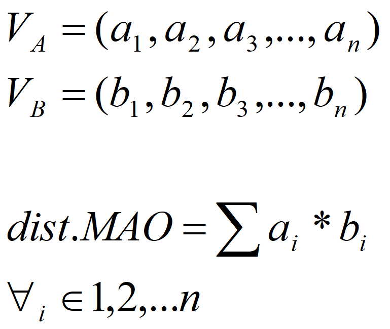

# 4.3 Basado en distancia MAO

Para comparar lo que se parecen dos vectores cuyos valores se encuentren normalizados, este algoritmo obtiene una distancia MAO entre ellos, como el valor del producto escalar de los vectores. Es decir, el grado de similitud entre los vectores vendrá dado por el ángulo que formen entre ellos. La distancia que se puede obtener, siempre es un valor entre 0 y 1, ya que dicho valor es el coseno del ángulo que forman los dos vectores despreciando los módulos por el calculo previo de la normalización. Simplificando enormemente los cálculos a realizar.



La función que habitualmente se utiliza en los programas que utilizan este algoritmo, es la siguiente:

```c
unsigned VecinoMasCercanoMAO(unsigned dim, unsigned numPat, float **patrones, float *vector, float *distancia)
{
    unsigned i, j;
    unsigned pMax;
    float dMax, dist;

    dMax = (float) LONG_MIN; /* -INFINITO inicialmente */
    pMax = numPat + 1;

    for(j=0;j<numPat;j++) {
        dist = 0.0;
        for(i=0;i<dim;i++)
            /*Producto escalar de cada elem. del vect. de entrada, con el de entrenamiento*/
            dist += (patrones[j][i] * vector[i]);

        if(dist > dMax) {
            dMax = dist;
            pMax = j;
        }
    }
    *(distancia) = dMax;
    return(pMax);
}
```

Con esta función, se calcula la distancia MAO, de cada vector de test con cada uno de los de patrón, y nos quedamos con el vector que ofrezca el valor de distancia más elevado. Como en el caso anterior nos encontramos con un método de clasificación por Vecino más Cercano salvo que hemos variado la distancia de comparación.
