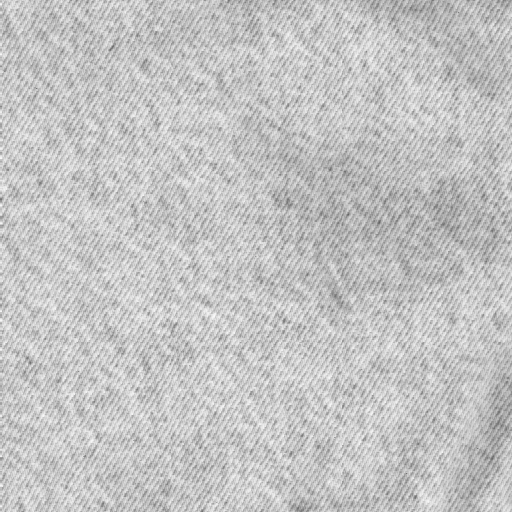
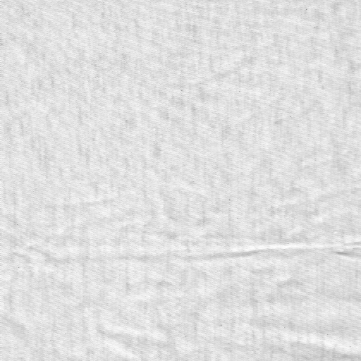
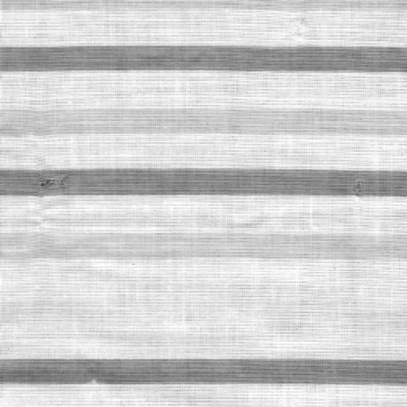
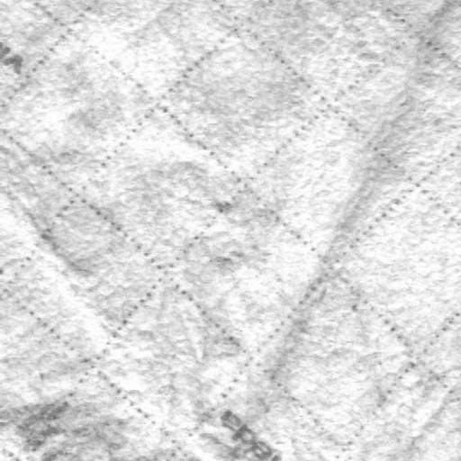
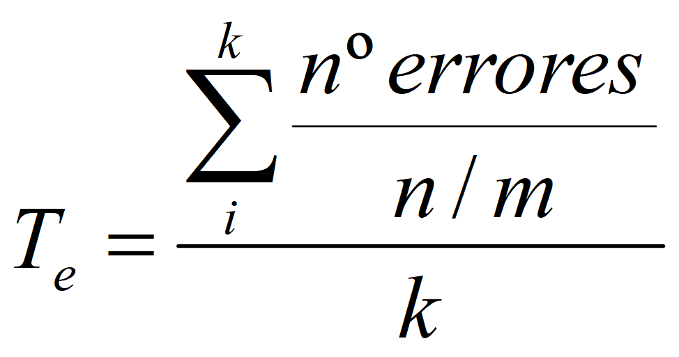

# 7.1. Preparacion de experimentos

Para los experimentos realizados en el proyecto se ha creado una batería de 40 imágenes mediante escaneado de 4 tipos de tejidos diferentes (Tela Blanca, Vaquera, De Rayas, y Bayeta Vileda). Todas las imágenes tienen un tamaño de 512x512 pixels, a 256 tonos de gris y a una resolución de 100dpi.

| Tela | Imagen |
|:---|:---:|
| Vaquera | |
| Blanca |  |
| Rayas |  |
| Vileda |  |
A la hora de crear las tandas de experimentos, y debido a que el conjunto de muestras es reducido (10 imágenes por cada tela), hemos considerado el método Leaving One-Out para evitar los siguientes problemas:

* Si utilizamos muchas imágenes para test, tendremos pocas para el entrenamiento, y por lo tanto los parámetros estarán mal estimados.

* Si utilizamos muchas para entrenamiento, dejaremos pocas para test, y por lo tanto la tasa de error calculada, no será significativa.

Este método consiste en la utilización de una muestra como Test, y las otras como Entrenamiento repitiendo los experimentos, dejando cada vez una muestra distinta fuera, de ahí su nombre.

La tasa de error, será la proporción entre el número de experimentos fallidos y el número de experimentos totales.

* Tamaño Imagen: n x n
* Tamaño Ventana: m x m
* Nº Imágenes: k
* Nº Clasificaciones x Imagen: n/m

