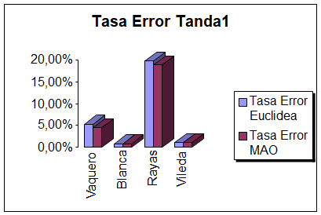
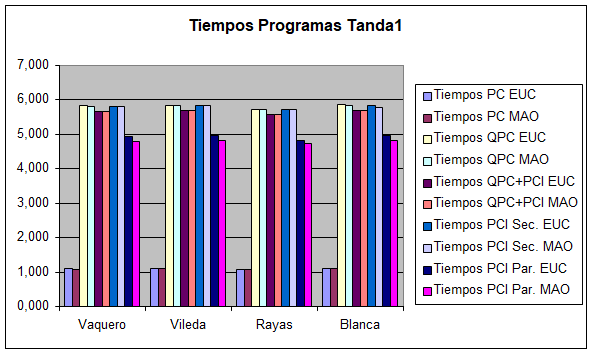
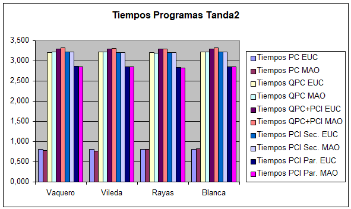
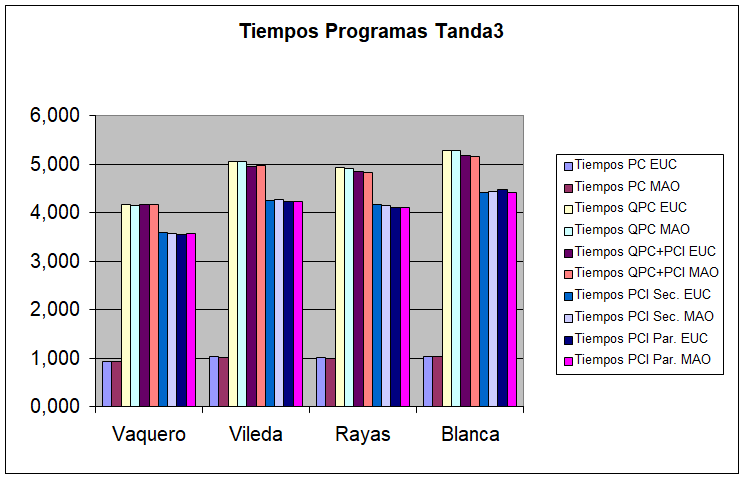
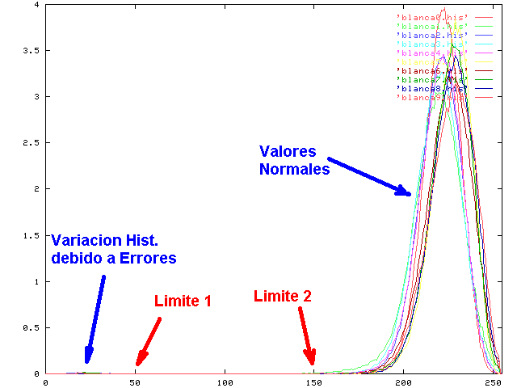
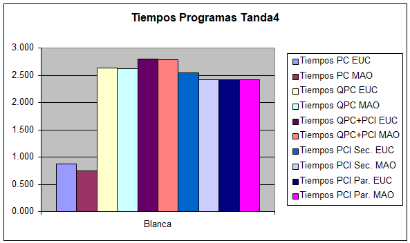

# 7.3. Tandas

A continuación se muestran los resultados de cada una de las tandas de experimentos realizadas.

Para todas las tandas realizadas se han tomado medidas tanto del tiempo de ejecución como de la tasa de error con las 10 variantes de programas implementados:
Los clasificadores por el método MAO y Euclideo, utilizando el Host, la Frame-Grabber, la PCI, y el conjunto FG-PCI.

Un parámetro que se ha fijado en todas las tandas de experimentos, ha sido el tamaño de la ventana a analizar, su tamaño es 64 x 64 que es el que mejor se ajusta en relación al  tamaño de las imágenes procesadas.

## 7.3.1 Tanda 1

­­­­En la Tanda 1, se realizan experimentos sobre los cuatro tipos de telas diferentes y aplicando los siguientes parámetros para el cálculo del CM:

|Parámetros del Calculo de C.M.|||||||
|---|---:|---:|---|---|---|---|
|Tam. Celdas|64|64|||||
|Nº Planos|5||||||
|Limites|-1|32|64|96|128|255|
|Piezas|1x1|2x2|3x3|4x4|5x5||
||NO|SI|SI|SI|NO||

Se han escogido los parámetros anteriores con vistas a comparar los resultados a obtener con los de la siguiente tanda que dispondrá de un número menor de tamaños de pieza.

* Tasa de Error:

    Clasificador Euclídeo

    | Imagen | Vaquero | Blanca  | Rayas  | Vileda  |
    |:---|---:|---:|---:|---:|
    | 0  | 0  | 0  | 0  | 0  |
    | 1  | 4  | 1  | 10 | 0  |
    | 2  | 5  | 0  | 13 | 0  |
    | 3  | 7  | 0  | 5  | 0  |
    | 4  | 3  | 0  | 16 | 0  |
    | 5  | 8  | 1  | 13 | 1  |
    | 6  | 2  | 0  | 19 | 1  |
    | 7  | 0  | 0  | 16 | 1  |
    | 8  | 3  | 0  | 19 | 2  |
    | 9  | 2  | 3  | 16 | 2  |
    | Total Errores | 34  | 5  | 127 | 7  |
    | Tasa Error | 5,31%  | 0,78%  | 19,84%  | 1,09% |

    Clasificador MAO

    | Imagen | Vaquero | Blanca  | Rayas  | Vileda  |
    |:---|---:|---:|---:|---:|
    | 0  | 0  | 0  | 0  | 0  |
    | 1  | 4  | 1  | 9 | 0  |
    | 2  | 6  | 0  | 8 | 0  |
    | 3  | 6  | 0  | 6 | 0  |
    | 4  | 3  | 0  | 16 |0   |
    | 5  | 7  | 1  | 12 | 1  |
    | 6  | 2  | 0  | 20 | 1  |
    | 7  | 0  | 0  | 14 | 2  |
    | 8  | 1  | 0  | 19 | 1  |
    | 9  | 0  | 3  | 16 | 2  |
    | Total Errores | 29 | 5  | 121 | 7  |
    | Tasa Error | 4,53%  | 0,78%  | 18,91%  | 1,09% |

* Gráfica comparativa

Como podemos observar en la gráfica, hemos obtenido resultados dispares dependiendo el tipo de tela que estamos analizando, teniendo la tasa de error más elevada para el tipo de tela más complejo, es decir, la de rayas. 

Los resultados según el tipo de clasificación vemos que no varían demasiado unos de otros, siendo un poco mejores con el clasificador por distancia MAO.

En cuanto a los tiempos de ejecución, a continuación se mostrará una gráfica comparativa de los tiempos de ejecución tanto por la implementación del clasificador empleado, como por el soporte de procesamiento empleado y distinguiendo entre los diferentes tipos de telas.

Una primera cuestión a reseñar es que los tiempos de ejecución del PC son sensiblemente menores. Esto puede ser debido a que la implementación del C.M. no aprovecha al máximo las capacidades de calculo de los DSP’s ya que en la implementación realizamos operaciones de comparación de valores y este tipo de operaciones no son las que están optimizadas para este tipo de procesadores. 

Otra cuestión que podemos destacar es que los tiempos de ejecución de las implementaciones con clasificadores MAO también son menores; debido a que este método de clasificación requiere un menor esfuerzo Computacional ya que el producto escalar de 2 vectores requiere del uso de operaciones más sencillas (productos y sumas) que la distancia Euclidea (productos, sumas y raíces cuadradas).

Podemos observar que la implementación del programa en la tarjeta PCI íntegramente (en su versión Paralela, claro esta) es la que mejor rendimiento proporciona, ya que en todo momento tenemos a los DSP’s trabajando, ya que mientras el segundo clasifica el resultado anterior, el primer DSP esta calculando el siguiente Coef. Morfológico con lo que disminuimos los tiempos de espera en ambos procesadores.

Otro dato destacable es que  la implementación que usa las dos tarjetas a pesar de los tiempos de espera para la comunicación de los resultados intermedios supera a la implementación con un solo DSP o a la Secuencial con 2 DSP’s ya que el clasificador conseguimos acelerarlo ya que la BD de patrones se divide entre los 2 procesadores de la PCI y estos trabajan en paralelo, disminuyendo por tanto el tiempo de clasificación.

## 7.3.2 Tanda 2

Para la Tanda 2 la variación de los parámetros del CM con respecto a la Tanda 1 han sido los tamaños de las piezas a procesar por cada imagen, ya que queríamos observar la influencia que eso supondría en los resultados de Tasa de Error y de tiempos de Ejecución.

|Parámetros del Calculo de C.M.|||||||
|---|---:|---:|---|---|---|---|
|Tam. Celdas|64|64|||||
|Nº Planos|5||||||
|Limites|-1|32|64|96|128|255|
|Piezas|1x1|2x2|3x3|4x4|5x5||
||NO|SI|NO|NO|NO||

Hemos reducido a una sola pieza de tamaño 2x2 pixels para cada celda de cada imagen y los resultados obtenidos han sido los siguientes:

* Tasa de Error:

    Clasificador Euclídeo

    | Imagen | Vaquero | Blanca  | Rayas  | Vileda  |
    |:---|---:|---:|---:|---:|
    | 0  | 0  | 0  | 0  | 0 |
    | 1  | 4  | 1  | 10 | 0 |
    | 2  | 4  | 0  | 16 | 0 |
    | 3  | 7  | 0  | 9  | 0 |
    | 4  | 4  | 0  | 17 | 0 |
    | 5  | 8  | 0  | 19 | 1 |
    | 6  | 2  | 0  | 12 | 1 |
    | 7  | 0  | 0  | 21 | 1 |
    | 8  | 3  | 0  | 15 | 2 |
    | 9  | 2  | 3  | 18 | 1 |
    | Total Errores | 34  | 4  | 137 | 6 |
    | Tasa Error | 5,31% | 0,63%  | 21,41% | 0,94% |

    Clasificador MAO

    | Imagen | Vaquero | Blanca  | Rayas  | Vileda  |
    |:---|---:|---:|---:|---:|
    | 0  | 0  | 0  | 0  | 0  |
    | 1  | 2  | 1  | 10 | 0  |
    | 2  | 3  | 0  | 17 | 0  |
    | 3  | 6  | 0  | 9  | 0  |
    | 4  | 4  | 0  | 17 | 0  |
    | 5  | 5  | 0  | 17 | 0  |
    | 6  | 2  | 0  | 15 | 1  |
    | 7  | 0  | 0  | 19 | 2  |
    | 8  | 1  | 0  | 19 | 1 |
    | 9  | 1  | 3  | 17 | 3 |
    | Total Errores | 24 |  4 | 140 | 7 |
    | Tasa Error | 3,75% | 0,63% | 21,88% | 1,09% |

* Gráfica comparativa

Los resultados de la tasa de error con respecto a los de la Tanda 1 se mantienen más o menos iguales aumentando en las telas Vaquera y de Rayas ya que hemos perdido cierta información en el cálculo del CM.

Veamos ahora el comportamiento en los tiempos de ejecución de los programas con estos parámetros.

Como podemos observar los tiempos se han reducido notablemente debido claro esta a la disminución de la complejidad en el calculo del Coef. Morfológico.

Las pautas de funcionamiento de los programas observadas en la anterior tanda se mantienen, es decir la más rápida sigue siendo la implementación sobre el PC seguida de la versión paralela de la PCI. Observamos que la versión que utiliza la FG y la PCI es más lenta que la que solo emplea la FG. Esto puede ser debido al tiempo en la comunicación de los diferentes procesadores que aquí si afecta más notablemente al disminuir el tiempo de calculo del CM.

## 7.3.3 Tanda 3

Para la tanda 3 hemos querido constatar la importancia que suponen tanto el numero de planos como la elección de los limites, eligiendo éstos de una manera homogénea, es decir todos los planos son del mismo tamaño (abarcan el mismo numero de tonos de gris). Se ha reducido el numero de planos con respecto a las anteriores tandas de 5 a 4 planos.

|Parámetros del Calculo de C.M.|||||||
|---|---:|---:|---|---|---|---|
|Tam. Celdas|64|64|||||
|Nº Planos|4||||||
|Limites|-1|64|96|128|255|
|Piezas|1x1|2x2|3x3|4x4|5x5||
||NO|SI|SI|SI|NO||

* Tasa de Error:

    Clasificador Euclídeo

    | Imagen | Vaquero | Blanca  | Rayas  | Vileda  |
    |:---|---:|---:|---:|---:|
    | 0  | 0  | 0  | 0  | 0 |
    | 1  | 9  | 10 | 11 | 14 |
    | 2  | 9  | 3  | 19 | 11 |
    | 3  | 9  | 9  | 9  | 10 |
    | 4  | 12 | 8  | 18 | 13 |
    | 5  | 23 | 1  | 22 | 11 |
    | 6  | 15 | 2  | 20 | 14 |
    | 7  | 14 | 1  | 26 | 12 |
    | 8  | 15 | 3  | 25 | 11 |
    | 9  | 21 | 2  | 18 | 16 |
    | Total Errores | 127 | 39 | 168 | 112 |
    | Tasa Error | 19,84% | 6,09% | 26,25% | 17,50% |

    Clasificador MAO

    | Imagen | Vaquero | Blanca  | Rayas  | Vileda  |
    |:---|---:|---:|---:|---:|
    | 0  | 0  | 0  | 0  | 0  |
    | 1  | 9  | 10 | 11 | 14 |
    | 2  | 9  | 3  | 19 | 11 |
    | 3  | 9  | 9  | 9  | 9  |
    | 4  | 12 | 8  | 18 | 12 |
    | 5  | 23 | 1  | 22 | 11 |
    | 6  | 15 | 2  | 20 | 13 |
    | 7  | 14 | 1  | 26 | 12 |
    | 8  | 15 | 3  | 25 | 13 |
    | 9  | 21 | 2  | 18 | 15 |
    | Total Errores | 127 | 39 | 168 | 110 |
    | Tasa Error | 19,84% | 6,09% | 26,25% | 17,19% |

* Gráfica comparativa

Al disminuir el número de planos a analizar, la tasa de error ha sufrido un notable incremento en todos los tipos de telas analizadas Por lo tanto el número de planos y la disposición de los mismos supone uno de los factores clave a la hora de obtener resultados aceptables. Mas adelante ajustaremos al máximo estos parámetros para obtener resultados prácticamente óptimos para el tipo de tela blanca (Tanda 4).

En cuanto a los tiempos de ejecución los resultados obtenidos son los siguientes:

Los tiempos de ejecución también han sufrido una ligera variación, disminuyendo claro esta sobre los de la primera tanda ya que el numero de planos es inferior aunque como vemos siguen las mismas pautas que las anteriores tandas.

## 7.3.4 Tanda 4

Para esta cuarta tanda de experimentos vamos a intentar mejorar los resultados de clasificación de una de las telas, la Blanca, intentando reducir al mínimo los parámetros del calculo del CM tanto en el número de planos como en los tamaños de pieza a aplicar.

Para estimar correctamente estos parámetros nos fijaremos en los Histogramas de frecuencias de las imágenes de esta tela.

En el Histograma de cada una de las imágenes se puede apreciar claramente como los valores que producen los errores están situados en una serie de frecuencias (tonos de gris) completamente alejados de las frecuencias normales de la imagen, por lo tanto bastara colocar los limites de planos en los valores marcados en la imagen para que en los valores obtenidos por el CM se diferencien claramente los patrones erróneos de los correctos. 

|Parámetros del Calculo de C.M.|||||||
|---|---:|---:|---|---|---|---|
|Tam. Celdas|64|64|||||
|Nº Planos|3||||||
|Limites|-1|50|150|255||
|Piezas|1x1|2x2|3x3|4x4|5x5|
||NO|SI|NO|NO|NO||

Además otra ventaja de estos valores de parámetros es que conseguimos reducir enormemente el número de patrones de la base de datos. De esta forma conseguimos además una serie de “estereotipos” que definen claramente a cada tipo de patrón erróneo o correcto.

* Tasa de Error:

    Clasificador Euclídeo

    | Imagen | Blanca |
    |:---|---:|
    | 0  | 0  |
    | 1  | 1  |
    | 2  | 0  |
    | 3  | 0  |
    | 4  | 0 |
    | 5  | 0 |
    | 6  | 0 |
    | 7  | 1 |
    | 8  | 0 |
    | 9  | 0 |
    | Total Errores | 2 |
    | Tasa Error | 0,31% |

    Clasificador MAO

    | Imagen | Blanca |
    |:---|---:|
    | 0  | 0  |
    | 1  | 2  |
    | 2  | 0  |
    | 3  | 0  |
    | 4  | 0 |
    | 5  | 0 |
    | 6  | 0 |
    | 7  | 1 |
    | 8  | 0 |
    | 9  | 0 |
    | Total Errores | 3 |
    | Tasa Error | 0,47% |

* Gráfica comparativa

Podemos observar que los resultados de la tasa de error en la tanda 4 han disminuido notablemente con respecto a los anteriores experimentos. Consiguiendo con los parámetros de esta ultima experimentación un acierto en un 99,5% de las clasificaciones; un resultado más que aceptable para su utilización.

Los tiempos de Ejecución conseguidos en esta tanda son los siguientes:

También se ha conseguido una ligera disminución en el tiempo de Computo ya que se han reducido al máximo tanto el número de planos como las piezas a aplicar sobre las imágenes.

***NOTA***: Todos los datos concretos de cada tanda de Experimentos se encuentran en el fichero en formato EXCEL 97 adjunto a esta documentación. Fichero *Experimentos.xls*
