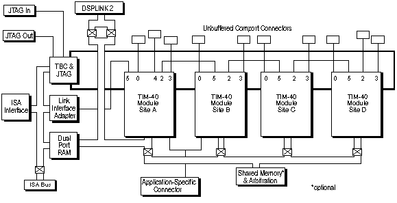

# 2.1 La tarjeta QPC/C40S + el modulo MDC40IM

A continuación se expone el diagrama de bloques de la tarjeta:

Las principales características de la tarjeta son:

* La placa dispone de cuatro zócalos (A, B, C y D), para insertar módulos TIM-40, permitiendo el procesamiento en paralelo de estos. 

* Un modulo frame grabber MDCC40IM de captura de imágenes monocromas, que permite la captura de imágenes de 256 grises a una resolución máxima de 512 x 512 pixels. Este módulo ocupa los zócalos A y B.

* Los módulos TIM-40 constan de un procesador TMS320C40, memoria y periféricos. La memoria puede ser SRAM, EDRAM, EPROM, VRAM o caché y su capacidad depende del tamaño de los buses de direcciones. El TIM-40 admite la instalación de periféricos para realizar tareas especificas. 

* Memoria de doble puerto DPRAM que se encuentra mapeada en la memoria del PC. Permite la comunicación rápida entre el módulo TIM-40 situado en el zócalo A y el PC.

* Link Interface Adapter (LIA). Interfaz que permite la comunicación directa entre el PC y el módulo TIM-40 situado en el zócalo A. Simula, mediante posiciones de memoria mapeadas en el PC, el trabajo de los puertos de comunicación del procesador TMS320C40.

* Test Bus Controller (T.B.C) que permite la implementación del depurador DB40 para la depuración de programas.

* Conector de 26 líneas de alta densidad (tipo “D”) para el módulo colocado en el zócalo A que  permite transportar señales digitales o analógicas.

* Interfaz de comunicación con PC AT y compatibles de 16 bits (bus ISA).

* Puertos paralelos de comunicación y de expansión.

## 2.1.1 El procesador TMS320C40

Especializado en la realización de operaciones aritméticas en coma flotante y permite el procesamiento en paralelo.

### 2.1.1.1 Características técnicas

* Reloj a 50 MHz.
* 25 Millones de instrucciones por segundo (M.I.P.S.).
* 275 Millones de operaciones por segundo (M.O.P.S.).
* 2 buses externos de direcciones de 32 bits.
* 6 puertos paralelos de comunicación.

### 2.1.1.2 La memoria SRAM

Es un modulo de memoria integrada en el módulo TIM-40. En el módulo TIM-40 colocado en el zócalo A esta memoria consta de dos submódulos de memoria SRAM, uno local y otro global. El submódulo local lo emplea el código COFF, mientras que el submódulo global esta a disposición del usuario.

## 2.1.2 El módulo de captura de imágenes MDCC40IM.

MDC40IM es un módulo de captura de imágenes monocromas basado en el procesador digital de señal TMS320C40. Esta diseñado para permitir la captura, procesamiento y visualización de imágenes monocromas, mientras se aprovecha la acelerada velocidad de procesamiento de un DSP.

### 2.1.2.1 El Módulo TIM-40

El diseño del módulo MDC40IM TMS320C40 es compatible con la especificación de los módulos Texas Instruments TIM-40.

MDC40IM es el doble de ancho que un módulo TIM-40 y ocupa dos zócalos simples adyacentes en la tarjeta portadora. El procesador C40 esta relacionado con el zócalo primario y la circuitería adicional de vídeo con el zócalo secundario.

MDC40IM tiene cinco conectores para la conexión con la tarjeta portadora. Estos son: el primer y último conector primario del zócalo primario, el primer y ultimo conector secundario del zócalo secundario y el conector de bus global del zócalo primario.

El primer y último conector secundario sirven para:

* Conexión con el pin especifico para aplicaciones.
* Soporte mecánico.
* Conexión a alimentación y tierra.
* Conexión con el puerto de comunicaciones.

Consta de un procesador TMS320C40 con un banco de 1M(x32)  o 4M(x32) de DRAM dinámica y un banco de 128K(x32) de SRAM estática. La DRAM esta conectada al puerto de memoria local del procesador y la SRAM esta conectada al puerto de memoria global.

También tiene una PEROM que proporciona la ROM de identificación (ID ROM) acorde a la especificación de los módulos TIM-40. Esto es necesario para almacenar datos como los valores de configuración dependientes del hardware y es accedido por el procesador TMS320C40 durante el arranque. La PEROM también puede almacenar código de arranque y el módulo MDC40IM puede ser configurado para arrancar desde la PEROM. Tiene un tamaño de 32K(x 8) y puede ser programado a través del procesador TMS320C40 para almacenar código de arranque y/o actualizar los datos de la ID ROM.

El procesador C40 localizado en el módulo MDC40IM  proporciona seis puertos de comunicación de alta velocidad numerados del 0 al 5 que están direccionados al primer y ultimo conector primario. Estos pueden ser usados para el procesamiento paralelo a alta velocidad mediante la comunicación con otras tarjetas y con otros módulos TIM-40.

El módulo también tiene un oscilador de reloj, pero también se puede obtener la señal de reloj de la tarjeta portadora QPC/C40s si es necesario.

### 2.1.2.2 Capacidades del Módulo de Imágenes

MDC40IM contiene circuitos adicionales específicos para la captura de imágenes de vídeo y para su visualización. Permite la digitalización de varias fuentes de vídeo diferentes, incluyendo los formatos estándar CCIR y RS-170. También soporta entradas entrelazadas y no entrelazadas. Un módulo externo de vídeo y/o de sincronía TTL puede ser aceptado como parte de la señal de entrada o como una entrada de sincronía separada.

La señal de sincronía principal usada en el MDC40IM puede ser adquirida a partir de una entrada externa o de un generador de señal interno.

El módulo conversor Analógico - Digital puede digitalizar imágenes monocromas de hasta 512 x 512 pixel con tasas de muestreo de 9.8 MHz a 18 MHz. Cada pixel es representado por 8 bits, proporcionando 256 escalas de grises. 

Posee dos bancos de VRAM (Vídeo RAM) de tamaño 256K(x8) para capturar y almacenar la imagen, uno primario y uno secundario (overlay). Las imágenes se capturan en tiempo real y pueden ser visualizadas directamente en la VRAM.  Este proceso lo realiza un RAM DAC, de forma que proporciona una salida en pseudocolor de los datos de ambas memorias. Además tiene un convertidor Digital - Analógico que proporciona una salida analógica RGB.