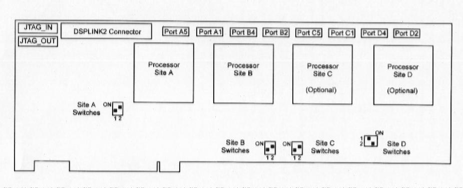

# 2.2 Tarjeta multiprocesadora PCI/C44S

La tarjeta PCI/C44S forma parte de la gama de tarjetas para PC de LSI basada en el DSP TMS320C4x de Texas Instruments. Las principales características de esta tarjeta se enumeran a continuación:

* La tarjeta PCI/C44S tiene hasta 4 procesadores TMS320C44 a 50mhz o 60mhz cada uno de los cuales tiene acceso exclusivo a 2 bancos de memoria RAM Estática (SRAM) con cero estados de espera y a un banco de ROM programable y borrable (PEROM).

* Un completo interface PCI de 32 bits permite una rápida comunicación entre el PC Host, la PCI/C44S y otros periféricos PCI. El bus PCI también permite una configuración muy sencilla de una serie de funciones de la PCI/C44S.

* Un banco de memoria SRAM compartida es accesible desde cada uno de los procesadores C44 y desde el interface PCI. Esto posibilita que puedan ser desarrollados mecanismos de intercambio de datos entre los procesadores C44 y entre los procesadores y el PC Host.

* Existen dos variantes de tarjetas PCI/C44S:

    * PCI/C44S1 tiene una SRAM local de 128k palabras, una SRAM global de 128k palabras y una SRAM compartida de 128k palabras.

    * PCI/C44S3 tiene una SRAM local de 512k palabras, una SRAM global de 512k palabras y una SRAM compartida de 512k palabras.

* Los cuatro puertos de comunicación paralela de cada procesador C44 permiten un método primordial para la comunicación entre procesadores.

* Una serie de periféricos (E/S) pueden ser accedidos desde la tarjeta PCI/C44S mediante el uso de la interface DSPLINK2 desarrollada por LSI. Este interface proporciona una transferencia paralela de datos desde/hacia los periféricos E/S, totalmente independiente del bus PCI.

* El Test Bus Controller (TBC) situado en la placa permite que los procesadores C44 sean accedidos a través de la interface PCI mediante el uso de el circuito JTAG.

* Se facilitan librerías software junto con la tarjeta que van a simplificar tanto el desarrollo como el diseño de entornos de ejecución.

El diagrama de bloques de la tarjeta PCI/C44S es el siguiente:

## 2.2.1 COMPONENTES DE LA TARJETA

### 2.2.1.1 PROCESADORES TMS320C44

Los procesadores TMS320C44 (en adelante C44) forman parte de la generación de procesadores en punto flotante de Texas Instruments TMS320C4x. Sus características incluyen 2 buses de direcciones de 24 bits, 2 buses de datos de 32 bits, cuatro puertos paralelos de comunicación, un coprocesador DMA de 6 canales y dos temporizadores.

La tarjeta PCI/C44S contiene hasta 4 procesadores C44 a 50MHz o 60MHz. Cada procesador tiene acceso a 2 bancos de memoria SRAM con cero estados de espera y una memoria PEROM. Todos los procesadores tienen acceso a un bus compartido que facilita una serie de recursos que incluyen un banco de memoria compartida SRAM. El procesador A de la placa también tiene acceso a la interfaces de expansión de E/S DSPLINK2 desarrollada por LSI.

Operando a 50MHz, los procesadores C44 pueden alcanzar un máximo de 25 MIPS y 275 MOPS. Si operasen a 60MHz, estos procesadores podrán llegar a alcanzar 30 MIPS y 330 MOPS.

Un dibujo ilustrativo de los distintos componentes de la tarjeta y su situación en la placa se expone a continuación:

### 2.2.1.2 Organización de la memoria de la tarjeta

Cada procesador C44 incorpora dos bancos de memoria SRAM (RAM estática) de 128 o 512K palabras con cero estados de espera. El banco 0 esta conectado al puerto de memoria local del procesador mientras que el banco 1 queda conectado al puerto de memoria global. La tarjeta PCI/C44s también dispone de una memoria SRAM compartida por todos los procesadores con un tamaño de 512K o 2M. De hecho, esta es la memoria a la que puede acceder el PC a través de bus PCI.

Cada bus local de los distintos procesadores tiene también un banco de memoria PEROM mapeado que puede ser utilizado para contener código de arranque o información de identificación de la tarjeta. Cada banco de memoria PEROM tiene un tamaño de 32K x 8 bits que solo pueden ser accedidos a través del procesador para actualizar el código de arranque o la identificación de la tarjeta. Este banco de memoria esta conectado al puerto de memoria local del procesador.

Otro tipo de memoria que incluye la tarjeta es la EEPROM que contiene la información hardware esencial necesaria para la inicialización del dispositivo PLX PCI9060 incluido en el interface PCI de la tarjeta.

#### 2.2.1.2.1 Interface de Memoria Local

La memoria local externa de cada procesador C44 incorpora un banco de memoria SRAM (banco 0) y una memoria PEROM. El mapa de memoria local de cada procesador puede verse en la tabla 1 del Apéndice de Tablas del artículo “La tarjeta PCI/C44S”.

Por un lado, la memoria local externa de cada uno de los procesadores de la tarjeta PCI/C44S incluye un banco SRAM con 0 estados de espera, el banco 0. La memoria SRAM local comienza en la dirección 0030 0000h y su imagen llega hasta la dirección 4000 0000h. La memoria SRAM local junto con la memoria RAM interna (bloques 0 y 1 respectivamente) constituyen un bloque contiguo de memoria. Con esto se consigue evitar la inconveniencia que supondría trabajar con bloques de memoria separados donde, por ejemplo, el programador debería controlar que el código del programa saltase de un bloque a otro si el tamaño de dicho programa supera el tamaño de cualquiera de los bloques.

En segundo lugar, en el puerto local de cada procesador se encuentra la memoria PEROM (memoria ROM programable y borrable) entre las direcciones 7000 0000h 7000 7FFFh. Hay que hacer notar que la memoria PEROM es accedida en la dirección 4000 0000h mientras se produce el arranque del procesador C44. El dispositivo PEROM, con una ancho de banda de 8 bits, esta conectado a las líneas locales de datos LD0 a LD7. Las líneas LD8 – LD31 no son utilizadas por la memoria PEROM y, de hecho, si se quisiesen leer contendrían valores indefinidos. La memoria PEROM puede ser utilizada bien como contenedor de código de arranque o bien como una ROM de identificación de la tarjeta. Además, también puede contener datos adicionales si fuese necesario. Cada memoria PEROM de cada procesador contiene código de arranque diseñado por LSI por defecto. Puede ser programada a través de su correspondiente procesador C44 que va a permitir actualizar el código de arranque o la ROM de identificación.

#### 2.2.1.2.2 Interface de Memoria Global

La memoria global de cada procesador C44 incorpora un banco de memoria SRAM por procesador (banco 1) y las direcciones mapeadas de los recursos del bus compartido de la tarjeta PCI/C44. La distribución de la memoria SRAM global de cada procesador puede verse en la tabla 2 del Apéndice de Tablas del artículo “La tarjeta PCI/C44S”.

Como ya hemos dicho, la memoria global de cada procesador incluye un banco de memoria SRAM con 0 estados de espera, el banco 1 cuyas dimensiones son de 128k x 32 o 512 x 32 según el modelo. La memoria SRAM global comienza en la dirección 8000 0000h como muy bien se puede observar en la tabla anterior. Este banco de memoria solamente puede ser accedido por el bus global privado de cada procesador y no se puede acceder a él a través del bus compartido del PC.

#### 2.2.1.2.3 Registros de Control del Interface de Memoria

Tanto el bus local como el bus global deben ser configurados para poder operar con la memoria que tienen conectada a ellos. Las configuraciones están contenidas en los registros de control del interface de memoria local (se trata de un registro de 32 bits al que se puede acceder a partir de la dirección 0010 0004h) y global (se trata de un registro de 32 bits al que se puede acceder a partir de la dirección 0010 0000h). Estos registros son idénticos en tamaño aunque, obviamente, realizan distintas configuraciones. Estos registros deben ser inicializados de forma que indiquen:

* Número de estados de espera software a generar
* Los rangos activos de la señales /LSTRB0 y /LSTRB1 para la memoria local y /STRB0 y /STRB1 para la memoria global
* Los tamaños de página de las memorias en base a los valores que adopten las señales anteriores

El código de arranque LSI contenido en la memoria PEROM de cada procesador configurará automáticamente estos registros con los valores adecuados.

### 2.2.1.3 Recursos del bus compartido

La tarjeta PCI/C44S ofrece un bus compartido al que se puede acceder mediante una serie de posiciones mapeadas de memoria. Los recursos que ofrece son:

* Un banco de memoria SRAM compartida
* Los registros del PCI9060
* El espacio de acceso PCI

Estos recursos del bus compartido pueden ser accedidos bien a través de uno de los procesadores C44 o mediante el interface PCI. Para ello, la propia tarjeta tiene su sistema de arbitraje para prevenir cualquier contienda.

El  mapa de la memoria SRAM compartida puede queda recogido en la tabla 4 del Apéndice de Tablas.

#### 2.2.1.3.1 SRAM

Los recursos del bus compartido incluyen un único banco de memoria SRAM compartida con dos ciclos de acceso. Estos dos ciclos suponen que los accesos de lectura se realizan mediante un estado de espera, mientras que los accesos de escritura no implican estados de espera. 

La memoria compartida SRAM esta situada en la dirección C000 0000h del mapa de memoria global de cada procesador C44. Puede ser accedido exclusivamente por cualquiera de los procesadores C44 o por el interface PCI. Para prevenir cualquier incidencia durante los accesos se emplea un sistema de arbitraje. En un determinado momento, pueden estar uno o más procesadores así como la interface PCI esperando acceder a la SRAM. Esto supondrá un cierto retardo en el software si se quieren realizar una serie de accesos de lectura o escritura desde más de un dispositivo.

El arbitraje se emplea para asegurar que en un momento determinado el bus compartido sólo esta bajo el control de un dispositivo. El algoritmo de arbitraje de la tarjeta tiene 2 niveles de prioridad. El interface PCI tiene el nivel de prioridad más alto mientras que los cuatro procesadores C44 tiene la misma prioridad que es inferior a la de la interface PCI. Los procesadores tiene garantizado su acceso mediante Round-Robin.

El orden de preferencia de los procesadores C44 forma una cadena desde el procesador A al B al C y al D y de nuevo al A. si en un momento determinado el interface PCI solicita el acceso al bus compartido, el interface PCI conseguirá el control del bus una vez que el procesador actual complete su acceso. Cuando el interface PCI haya terminado su acceso, el control del bus compartido pasará a manos del siguiente procesador en la secuencia Round-Robin.

#### 2.2.1.3.2 Registros del PCI9060

La tarjeta PCI/C44S incorpora un interface PCI muy rápida que cumple con las especificaciones PCI existentes. Se trata de un bus PCI de 32 bits que tiene una tasa máxima de transferencia de datos de 132Mb/s y, que, por tanto, es mucho más rápida que los obsoletos buses ISA.

El interface PCI de la tarjeta viene suministrado por un dispositivo PLX PCI9060. Este dispositivo contiene los registros requeridos por la especificación PCI e incorpora las siguientes características:

* un controlador DMA con 2 canales independientes
* un generador programables de interrupciones
* registros de “buzón” y “timbre”

Los cuatro grupos de registros empleados para inicializar la interface PCI pueden ser accedidos a través del bus compartido de la tarjeta PCI/C44S. Estos registros posibilitan tanto la configuración del PCI como la transferencia de datos entre el bus compartido de la tarjeta y el bus PCI. 

Cada registro tiene una única dirección en el PCI9060 y se mapea mediante los registros de configuración del PCI que conforman un área de la memoria global del PCI/C44S. La descripción de los registros del PCI9060 que se va a realizar va a ser muy superficial. Dicho todo esto, los cuatro grupos que conforman los registros del PCI9060 son los siguientes:

* Registros de Configuración PCI
Estos registros contienen información detallada de la configuración de la tarjeta PCI/C44S, incluyendo información de identificación y las direcciones base de los tres grupos de registros restantes.

* Registros de Configuración Local
Estos registros definen el tamaño y la dirección de los recursos de la tarjeta que son accesibles por el máster PCI. También controlan la lectura/escritura directa hacia/desde el bus PCI a través de los procesadores C44.
	
* Registros Compartidos en Tiempo de Ejecución

    Se trata de 10 registros que se distribuyen en:

    * 8 registros de 32 bits llamados “buzones” (numerados del 0 al 7) que son accesibles tanto por el bus PCI como por la propia tarjeta. 

    * 2 registros de 32 bits llamados “timbres” que permiten generar interrupciones hacia/desde la tarjeta  PCI/C44S. 
	  
* Registros Locales DMA

    El controlador DMA del PCI9060 tiene 2 canales, a saber, canal 0 y canal 1. Cada canal contiene 4 registros que pueden ser configurados si se desea realizar una transferencia de datos DMA a través de la interface PCI. En realidad, el controlador DMA es la forma más rápida y eficiente de mover datos hacia/desde un dispositivo PCI como el PC Host o una tarjeta PCI. 

#### 2.2.1.3.3 Espacio de acceso PCI

Esta localizado en el bus global de cada procesador C44. Este espacio esta mapeado para el bus PCI de tal forma que podemos realizar accesos directos a otro dispositivo PCI (como un PC Host u otra tarjeta PCI) desde la tarjeta PCI/C44S. 

Cuando se realiza un acceso directo máster (se llama acceso máster a una solicitud de cualquier procesador de la tarjeta del bus PCI), el espacio de acceso PCI es mapeado de nuevo para el dispositivo destino (desde/hacia el que se dirige la transferencia) en el bus PCI. Cada vez que se lee/escribe desde/hacia el espacio de acceso PCI, se esta leyendo/escribiendo desde/hacia el dispositivo destino propiamente. El re-mapeado se lleva a cabo configurando algunos de los registros de configuración PCI y de los registros de configuración local

### 2.2.1.4 Puertos de Comunicación Paralela

Cada procesador C44 dispone de cuatro puertos de comunicación. Dos ellos están libres y los otros dos se usan para comunicación entre procesadores y están conectados formando una topología en anillo. Todo esto constituye un sistema extremadamente flexible que permite una rápida conexión de procesadores y tarjetas sin necesidad de prototipado o un desarrollo hardware.

El sistema de procesamiento paralelo de la tarjeta PCI/C44S es capaz de soportar una ejecución optima mediante la distribución de tareas entre 2 o más procesadores. El multiprocesamiento requiere que la transferencia de datos entre los procesadores sea lo más rápida posible. Para conseguirlo, la tarjeta utiliza los puertos de comunicación paralela disponibles en cada uno de los procesadores C44. De este modo, se consigue una rápida comunicación procesador - procesador.

Las principales características de cada uno de los puertos de comunicación de los procesadores C44 son:

* El máximo nivel de transferencia bidireccional de datos para un C44 a 50MHz es de 20Mb/s. Para un C44 a 60MHz, la tasa es de 24Mb/s.

* La comunicación procesador - procesador es directa.

* Existe un arbitraje automático para asegurar una comunicación síncrona.

* La sincronización entre la CPU o el coprocesador DMA y los puertos de comunicación se realiza mediante el uso de señales e interrupciones internas.

* Soportan una gran variedad de arquitecturas de multiprocesamiento.

Cada procesador de la placa tiene 4 puertos (sin buffer) de comunicación numerados 1, 2, 4 y 5. Dos de ellos están libres y conectados a las cabeceras en el extremo de la placa permitiendo la interconexión con otros dispositivos dentro o fuera de la placa. Los dos puertos restantes están conectados formando una topología en anillo, permitiendo, de este modo, una línea de comunicación “dedicada” entre los procesadores. El siguiente esquema muestra la distribución de los puertos:

### 2.2.1.5 Interface DSPLINK2

La tarjeta PCI/C44S viene equipada con un sistema de expansión digital: DSPLINK2 de LSI. DSPLINK2 es una extensión del DSPLINK estándar y consiste en un bus bidireccional de alta velocidad que permite la comunicación entre un periférico de E/S y el procesador C44 localizado en el lugar A (C44 A), sin necesidad de utilizar el bus PCI que conecta la tarjeta con el PC. Esto supone la capacidad de la tarjeta de una expansión paralela con un ancho de banda de 32 bits y que tiene un mapeado de memoria con 256 posiciones.

El procesador A de la tarjeta PCI/C44 tiene el acceso exclusivo al interface de expansión digital DSPLINK2 desarrollado por LSI. DSPLINK2 es accedido a través de la dirección de memoria 4020 0000h de la memoria global del procesador A. Esta zona de memoria esta reservada y no se utiliza en el resto de procesadores.
El interface DSPLINK2 esta mapeado en 5 espacios en el mapa de memoria (memoria local del procesador A) de la tarjeta: espacio 1, 2, 3, 4 y 5 como queda expuesto en el tabla 5 del Apéndice de Tablas situado al final del documento.