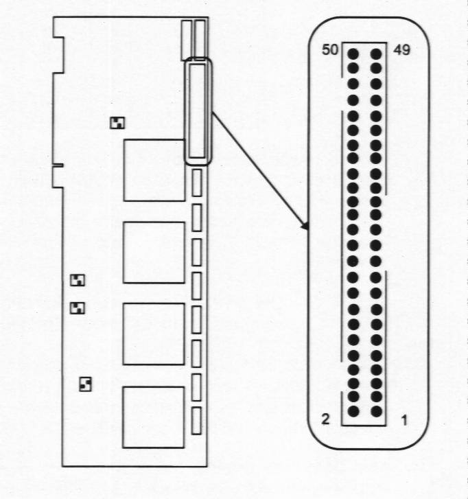
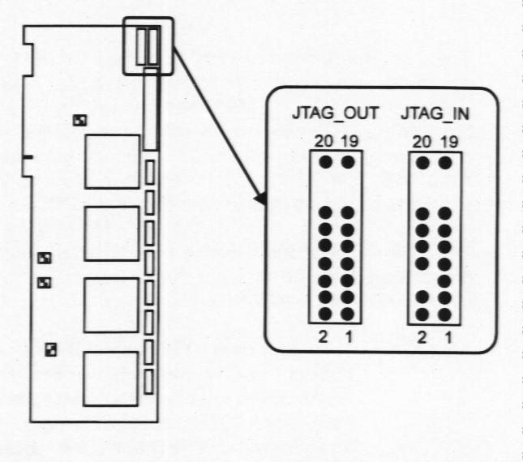
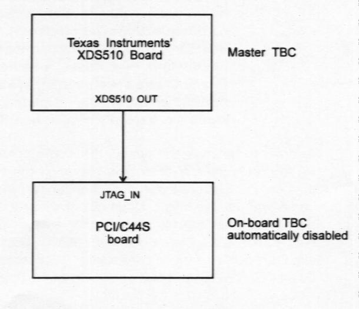

# 5.3 Comunicación DSP y otro Periférico (otra tarjeta)

## 5.3.1 DSPLINK2

A la hora de establecer la comunicación entre la tarjeta PCI/C44S y otra tarjeta o periférico PCI, se va a utilizar el interface DSPLINK2 desarrollado por LSI. La tarjeta PCI/C44S viene equipada con un sistema de expansión digital: DSPLINK2 de LSI. DSPLINK2 es una extensión del DSPLINK estándar y consiste en un bus bidireccional de alta velocidad que permite la comunicación entre un periférico de E/S y el procesador C44 localizado en el lugar A (C44 A), sin necesidad de utilizar el bus PCI que conecta la tarjeta con el PC. Esto supone la capacidad de la tarjeta de una expansión paralela con un ancho de banda de 32 bits y que tiene un mapeado de memoria con 256 posiciones.

El procesador A de la tarjeta PCI/C44 tiene el acceso exclusivo al interface de expansión digital DSPLINK2 desarrollado por LSI. DSPLINK2 es accedido a través de la dirección de memoria 4020 0000h de la memoria global del procesador A. Esta zona de memoria esta reservada y no se utiliza en el resto de procesadores.

La interface DSPLINK2 ofrece una capacidad de expansión paralela con:

* gran ancho de banda
* 32 bits
* mapeado en memoria

La tarjeta PCIC44/S esta considerada como una tarjeta D32 DSPLINK2 máster. Esto significa que la tarjeta implementa las 32 línea de datos completamente. La localización y distribución de los pines del conector DSPLINK2 de 50 pines viene expuestos a continuación:

|Pin|Señal|Pin|Señal|
|:---:|:---:|:---:|:---:|
|1|Vcc|2|CHAS_GND|
|3|D15|4|D14
|5|D13|6|D12
|7|D11|8|D10
|9|D9|10|D8
|11|INT/WAIT|12|D7
|13|/RESET|14|D6
|15|D5|16|D4
|17|D3|18|/INT0
|19|D2|20|D1
|21|D0|22|/IOE
|23|/W|24|Gnd
|25|A7|26|A6
|27|A5|28|A4
|29|A3|30|A2
|31|A1|32|A0
|33|Gnd|34|D31
|35|D30|36|D29
|37|D28|38|D27
|39|D26|40|D25
|41|D24|42|D23
|43|D22|44|D21
|45|D20|46|D19
|47|D18|48|D17
|49|D16|50|Gnd

El  interface DSPLINK2 no es compatible con tarjetas DSPLINK1. Una tarjeta DSPLINK2 esclava se comunica con la tarjeta PCI/C44S a través del conector de 50 pines. Obviamente, el cable de conexión debe ser lo más corto posible.

El interface DSPLINK2 esta mapeado en 5 espacios en el mapa de memoria (memoria local del procesador A) de la tarjeta: espacio 1, 2, 3, 4 y 5 como queda expuesto en el tabla 5 del Apéndice de Tablas situado al final del documento.

Los primeros 4 espacios tienen estados de espera diferentes mientras que el espacio 5 da la opción de introducir ciclos de espera adicionales utilizando la señal /WAIT. En definitiva, estos espacios tienen como objetivo permitir el acceso a la tarjeta esclava en el menor tiempo posible.

A continuación se van a exponer una serie de tablas que van a recoger los tiempos de lectura, escritura y acceso así como los ciclos de reloj de los distintos espacios:

Tiempos considerados para una tarjeta PCI/C44S DSPLINK2 a 50 MHz

|Espacio|Tiempos E(ns) |Tiempos L(ns)|Tiempos ACC (ns)| Ciclos de Procesador Escritura|Ciclos de Procesador Lectura|
|:---:|:---:|:---:|:---:|:---:|:---:
|1|72|72|52|6|4
|2|112|112|92|7|5
|3|152|152|132|8|6
|4|192|192|172|9|7
|5|192+|192+|172+|9+|7+

Tiempos considerados para una tarjeta PCI/C44S DSPLINK2 a 60 MHz

|Espacio|Tiempos E(ns) |Tiempos L(ns)|Tiempos ACC (ns)| Ciclos de Procesador Escritura|Ciclos de Procesador Lectura|
|:---:|:---:|:---:|:---:|:---:|:---:
|1|59|59|40|6|4
|2|92|92|73|7|5
|3|125|125|106|8|6
|4|159|159|140|9|7
|5|159+|159+|140+|9+|7+

Así pues, para determinar cual es el espacio más rápido para los accesos de escritura, se debe seleccionar aquel espacio cuyo TE sea mayor o igual que el tiempo requerido por la tarjeta esclava. Por ejemplo, si la tarjeta esclava requiere como mínimo 100ns como TE, entonces se debería acceder a esa tarjeta a través del espacio 2 si la PCI/C44S es de 50mhz. Lo mismo ocurriría si se quisiera determinar el espacio mas rápido para los accesos de lectura.

## 5.3.2 JTAG

Para realizar la conexión de varias tarjetas, otra de las opciones disponibles es la ranura de conexión JTAG. La tarjeta PCI/C44S tiene dos conectores JTAG, JTAG_IN y JTAG_OUT situados en la esquina superior izquierda como se puede apreciar en el siguiente dibujo:

La distribución de los pines se especifica en el siguiente dibujo:

|JTAG_OUT||||
|---:|:---:|:---:|:---:|
|/GRESET(E/S)|20|19|/CONFIG(E/S)|
|SC|18|17|SC|
|SC|16|15|SC|
|EMU1(E/S)|14|13|EMU0(E/S)|
|GND|12|11|TCK(E)|
|GND|10|9|TCK_RET(S)|
|GND|8|7|TDO(E)|
|NC|6|5|SENSE(E)|
|GND|4|3|TDI(S)|
|/TRST(E)|2|1|TMS(E)|

SC=Sin conectar, E=Entrada, O=Salida

|JTAG_IN||||
|---:|:---:|:---:|:---|
|GRESET(E/S)|20|19|CONFIG(E/S)|
|SC|18|17|SC|
|SC|16|15|SC|
|EMU1(E/S)|14|13|EMU0(E/S)|
|GND|12|11|TCK(S)|
|GND|10|9|TCK_RET(E)|
|GND|8|7|TDO(S)|
|NC|6|5|PD(+5V)|
|GND|4|3|TDI(E)|
|/TRST(S)|2|1|TMS(S)|

SC=Sin conectar, E=Entrada, O=Salida

Las tarjetas deberían ser conectadas formando una cadena de forma que el JTAG_OUT de la primera tarjeta quede conectado al JTAG_IN de la siguiente y así sucesivamente. Para sistemas mayores, lo ideal sería conectar las tarjetas en varias cadenas JTAG separadas con el fin de optimizar la velocidad de procesamiento.
Cuando se utiliza una red como esta, la última tarjeta de una cadena JTAG debería esta conectada a la primera tarjeta de la siguiente cadena JTAG. Debido a las limitaciones de JTAG, la longitud máxima recomendable de una cadena JTAG es de 3 tarjetas para asegurar la correcta propagación de todas las señales a través de la cadena JTAG.

Un dibujo ilustrativo de una red de cadena como el comentado en el párrafo anterior es el siguiente:

En realidad, para poder realizar una conexión multitarjeta es necesario no sólo realizar la conexión a través de los conectores JTAG_OUT y JTAG_IN sino también es imprescindible utilizar el TBC (Test Bus Controller). Así pues, vamos a nombrar algunos de los tipos de conexión multitarjeta existentes:

* Conexión Simple

    Tarjeta XD5510 (Texas Instruments) - Tarjeta PCI/C44S

* Conexión Múltiple
	
    * Utilizando TBC

        Las tarjetas se conectan en cadena como hemos explicado en los párrafos anteriores. La primera tarjeta actúa como máster y tiene su TBC habilitado. Este TBC se utiliza para controlar a las demás tarjetas. El resto de tarjetas son capaces de detectar que la tarjeta máster tiene el TBC habilitado y automáticamente deshabilitan su propio TBC.

    * Utilizando un emulador externo

        El conector de salida (OUT) del emulador externo debe estar conectado a el conector JTAG_IN de la primera tarjeta de la cadena. En este caso, sólo el emulador tendrá activado su TBC y el resto de tarjetas lo desactivarán automáticamente.

