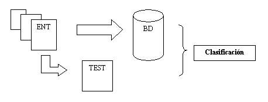

# 7.2. Creación de las Bases de Datos.

Para cada una de las tandas, y atendiendo a los parámetros del CM, se extraen los valores de éste para cada una de las imágenes.

Manualmente y para cada imagen se etiqueta cada uno de los vectores que representan a las ventanas en las que se ha dividido la imagen como bueno o malo. En nuestro caso un 0 representa un patrón defectuoso, y un 1, un patrón correcto.

Debido al método Leaving One-Out, se crea para cada imagen una base de datos que contendrá, los patrones de la imagen correcta de su serie y todos los patrones erróneos del resto de imágenes excluyendo los suyos propios. Con este método obtenemos una Base de Datos de Patrones que usaremos exclusivamente con la imagen para la que se ha creado, ya que si utilizáramos otra imagen diferente como Test, falsearíamos los resultados de ese experimento, ya que estaríamos clasificando una imagen  incluida en la BD del Conocimiento.

Este método es más costoso, en cuanto a tiempo de elaboración de las BD pero nos proporcionará un mayor número de experimentos, por tanto una tasa de error más fiable.